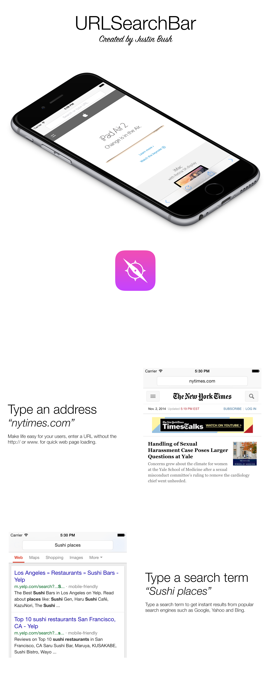

URLSearchBar is a free, open source project that combines the power of informal web addresses and instant search results.

## Features
- iPhone and iPad support
- URL / Search term detection
- Informal web address compatibility
- Universal search engine compatibility

## Usage
1. Copy URLSearchBar classes into existing project
2. Import and class URLSearchBar in your header file

   `#import "URLSearchBar.h"`

   `@class URLSearchBar;`

3. Create an IBOutlet for your bar 

   `@property (nonatomic, retain) IBOutlet URLSearchBar *urlField;`

4. Add the URLSearchBar setup to the ViewDidLoad method

   `[self.urlField setupBarWithWebView:self.webView];`

5. Specify the class of the UITextField in the Indentity Inspector as "URLSearchBar and make all connections in your storyboard

Refer to the Demo project if you're having trouble setting up the URLSearchBar.

## Requirements
- Requires iOS 7.0 or later
